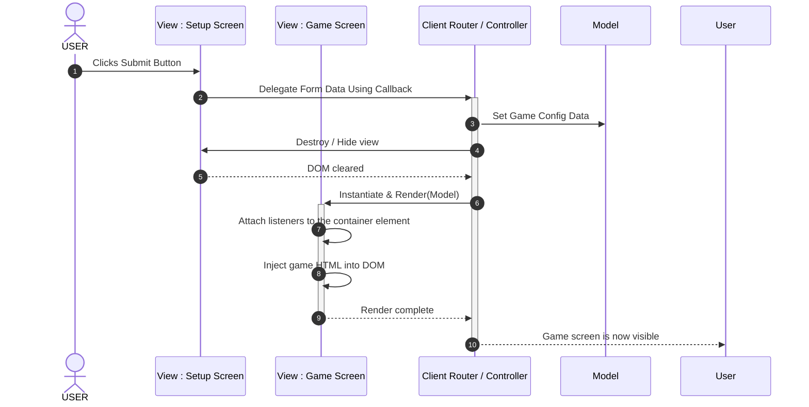

```mermaid
sequenceDiagram
    autonumber
    actor USER
    participant OldView as View : Setup Screen
    participant NewView as View : Game Screen
    participant Router as Client Router / Controller
    participant Model

    USER ->> OldView : Clicks Submit Button

     %% Old View notifies the Client Controller/Router
    OldView ->>+ Router : Delegate Form Data Using Callback

    %% Controller updates the client-side state/model
    Router->>Model: Set Game Config Data

    %% Controller manages the multi-screen layout switch locally
    Router->>OldView: Destroy / Hide view
    OldView-->>Router: DOM cleared

    Router->>+NewView: Instantiate & Render(Model)
    NewView->>NewView: Attach listeners to the container element
    NewView->>NewView: Inject game HTML into DOM
    NewView-->>-Router: Render complete

    Router-->>-User: Game screen is now visible
```
